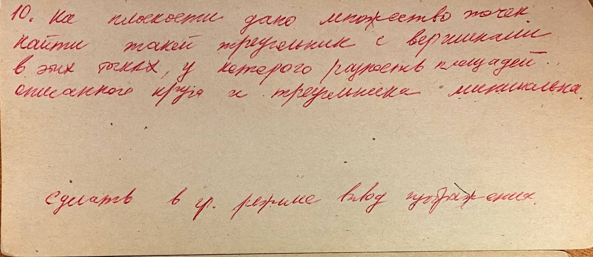
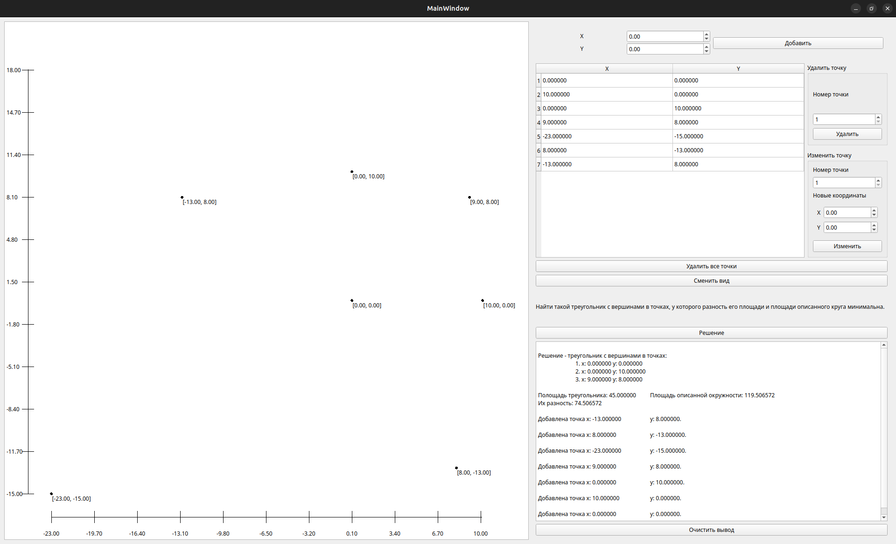
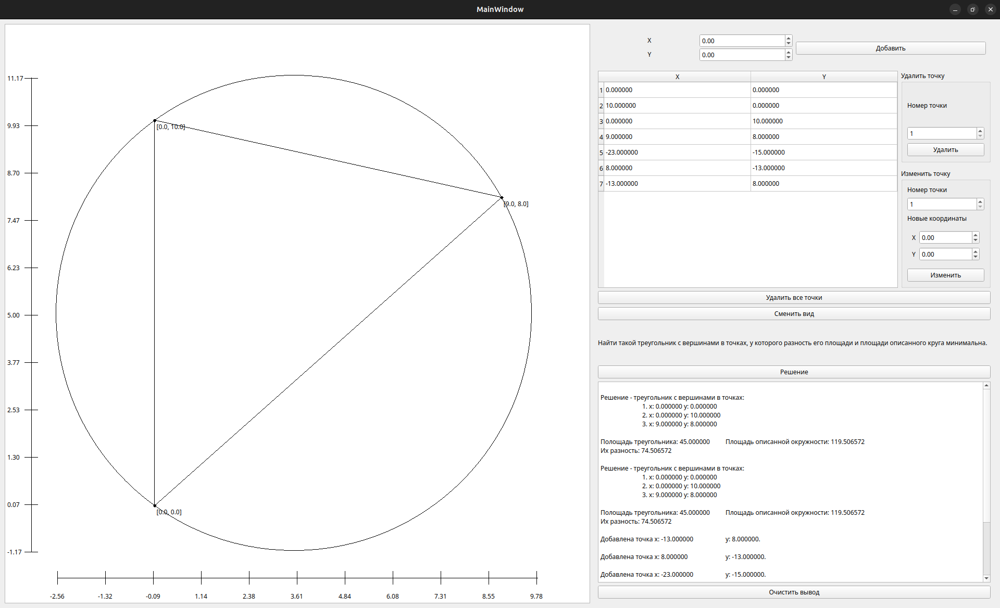

# Лабораторная работа 1.

5.5 баллов из 7.




*Вид всех добавленных точек.*


*Вид решения*

## Код

Сделано коряво, но работает.

От преподавателя было несколько претензий:
* При выводе точек в информации о решении, коряво выводятся отсупы между x y.
* Если при поиске решения не было найдено треугольников (например, все точки на одной прямой), выводить предупреждение с другим текстом.
* Во вложенных циклах в поиске решения счётчики неправильно ограничены сверху. (Сделано ```i < size```, должно быть ```i < size - 2```. Если ```i``` достигнет ```size - 2```, в массиве не будет хватать точек для построения треугольника, но цикл будет продолжать инкрементировать переменную и выполнять проверки, что занимает время).
* Корявая проверка на вырожденность треугольника (взял из какой-то своей старой лабы по пипону, уже не помню, чем думал). Лучше сдать через неравенство треугольника.
* Что-то про реализацию масштабирования в решении, но я так и не понял, что не так.
