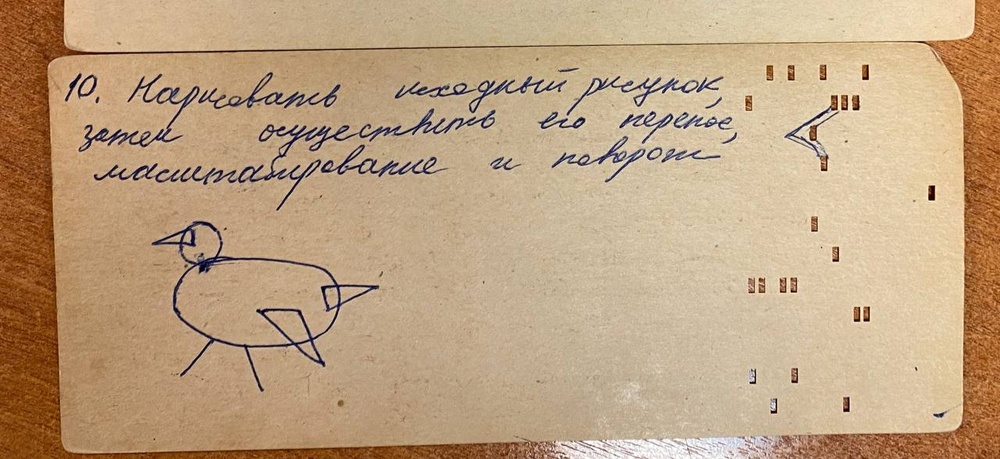
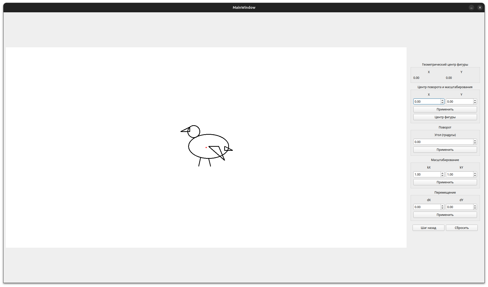
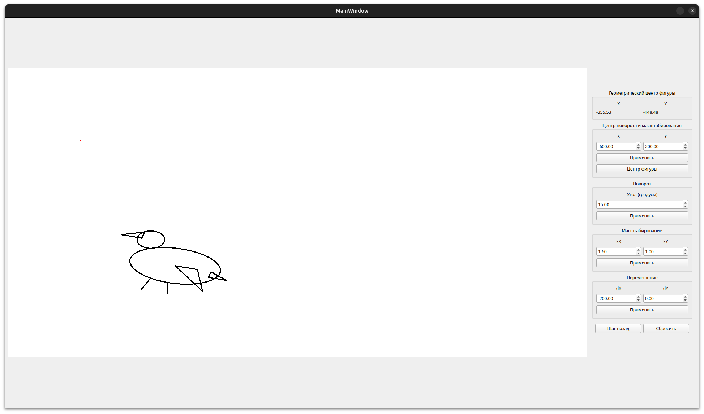

# Лабораторная работа 2.

4.5 баллов из 7.

*Задание*

*Начальный вид программы.*

*Вид после нескольких трансформаций*

По работе программы замечаний не было.

Вопросы:
* Какая система координат в вашей программе? (Декартова)
* Чем декартова СК отличается от экранной?
* Какие операции коммутативны?
* Что произойдёт с фигурой? (Вводил значения в поля масштабирования и просил описать, что будет после применения)
* Вопросы по масштабированию (При коэффициенте больше 1 точка удаляется от центра, от 0 до 1 - приближается, при отрицательных значениях то же самое, но с отражением)
