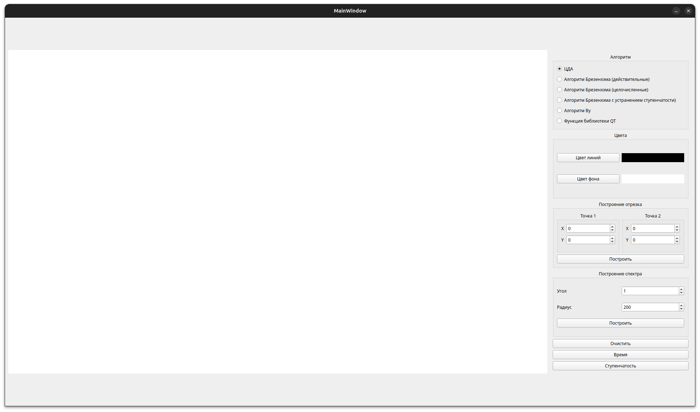

# Лабораторная работа 3.

4.5 баллов из 7.

*Задание*

*Интерфейс*

*Построенный спектр*

Замечания преподавателя:

Я провожу измерения времени выполнения, учитывая время отрисовки, что делать не нужно.

Вопросы:
* Что такое разложение отрезка в растр?
* Как работают алгоритмы (вопрос про то, что вычисляем пиксели пошагово).
* Как работает каждый из алгоритмов?
* Что такое ошибка?
* Зачем нужен алгоритм Брезенхема с устранением ступенчатости?
* Почему он называется "с устранением ступенчатости", но если присмотреться, ступеньки видно ещё отчетливее. Плохой аглоритим что ли??